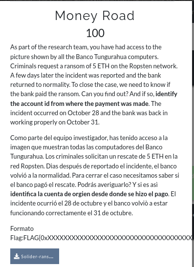
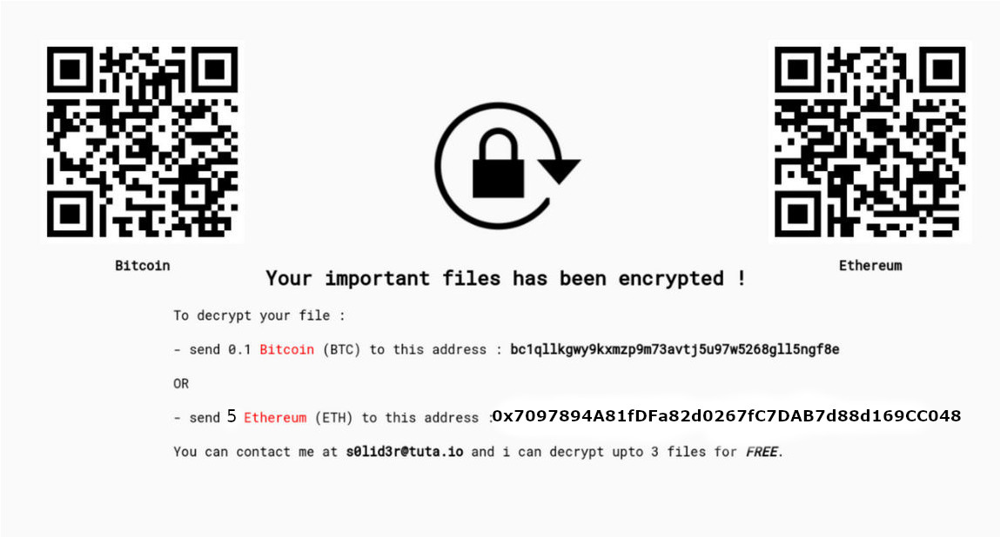
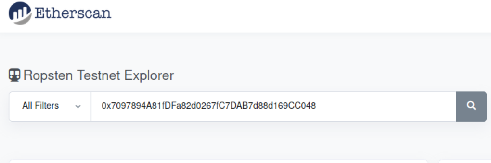
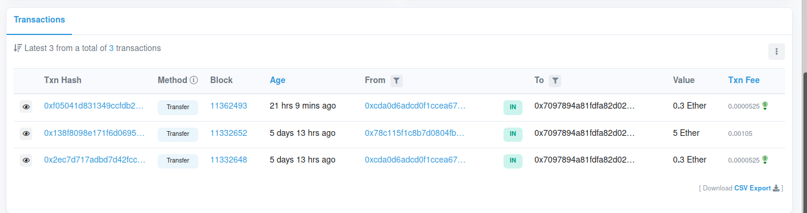

# #H3LL0 FRIENDS!
#

----
ANOTHER-MISC

**there is a jpeg attached with this chall wich contains lots of information to proceed further!**

#

```bash
┌──(root💀kali)-[/home/]
└─# tesseract Solider-ransomawre.jpeg from-image.txt                                     130 ⨯
Tesseract Open Source OCR Engine v4.1.1 with Leptonica
                                                                                               
┌──(root💀kali)-[/home/…/
└─# cat from-image.txt.txt       
   

B: Ethe
aa Your important files has been encrypted ! bast

To decrypt your file :

- send @.1 Bitcoin (BTC) to this address : belqllkgwy9kxmzp9m73avt j5u97w5268gl15ngf8e

OR

- send 5 Ethereum (ETH) to this address :0x7097894A81fDFa82d0267fC7DAB7d88d169CC048

You can contact me at s@lid3r@tuta.io and i can decrypt upto 3 files for FREE.
 ```
 
 **From description they mentioned ropsten**
 ----
 
 
 Search ropsten 
 
 1.copy the eth address 
 
 2.paste and search 

 3.check the traffic
 
 **From desc they said oct 31 So the flag is second address!**
 
 ----
 
 
 ---
 
 
## Flag : Flag{0x78c115F1c8B7D0804FbDF3CF7995B030c512ee78}
